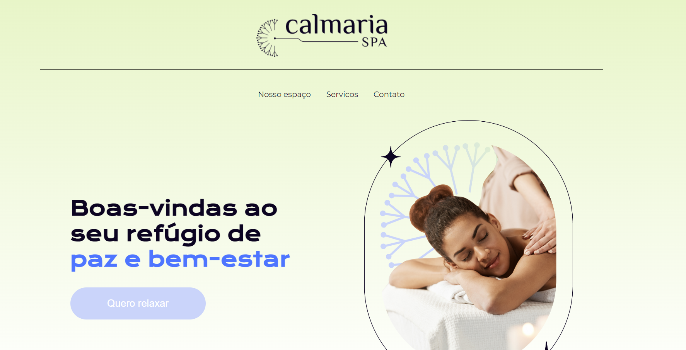
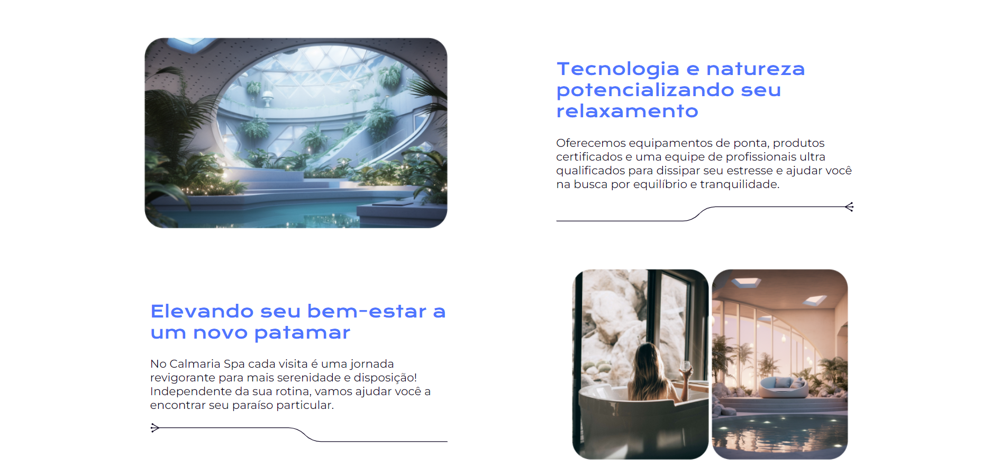
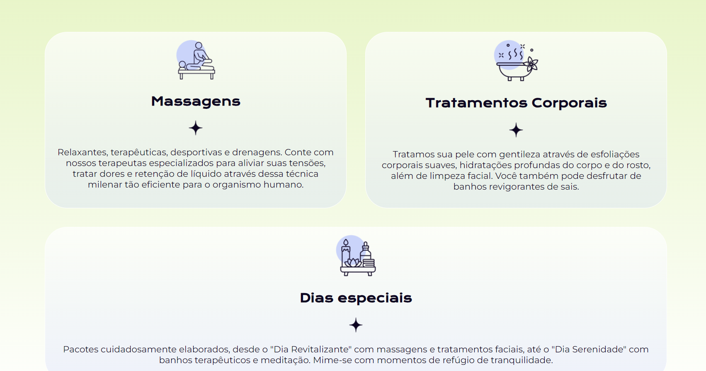
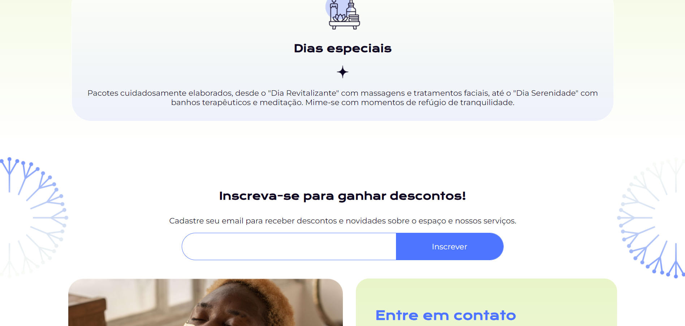
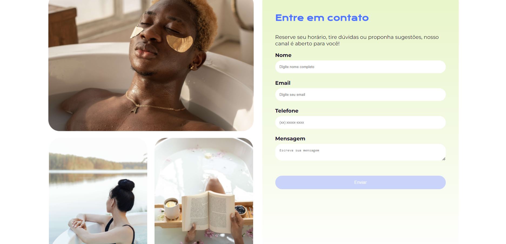
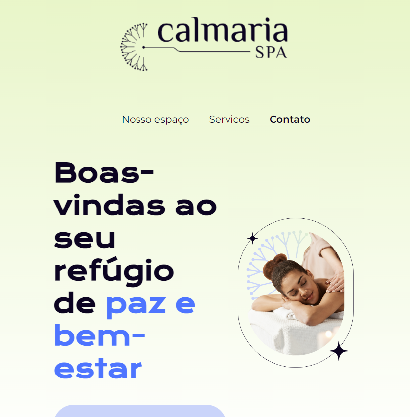
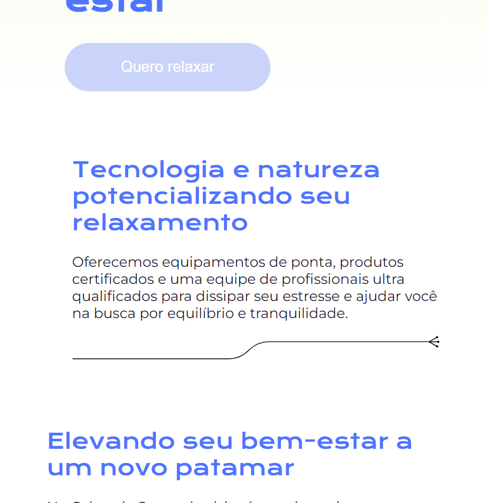
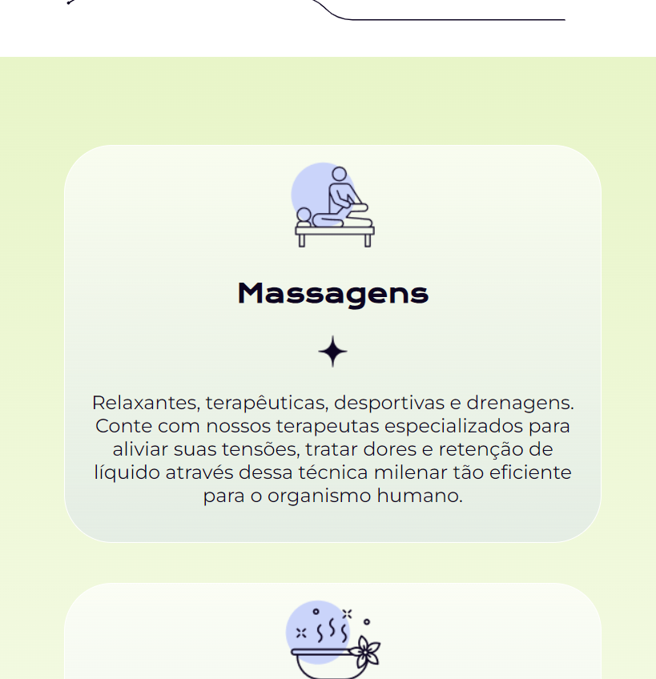
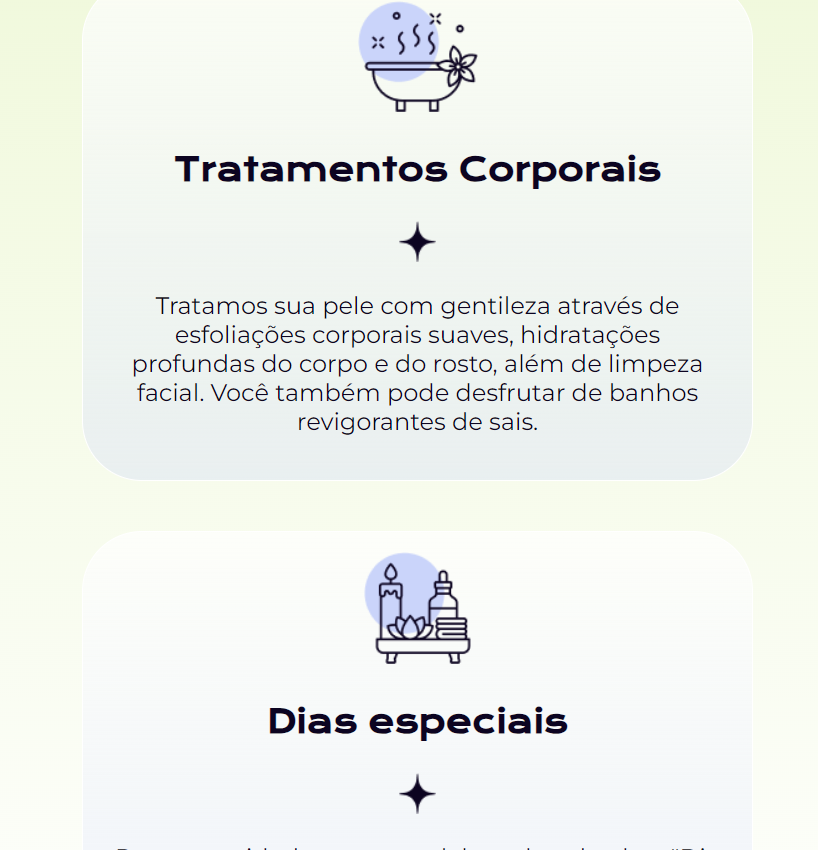

## Projeto Calmaria Spa
Descrição
Este projeto é um site para o Calmaria Spa, que oferece serviços de relaxamento e bem-estar. O site apresenta informações sobre os serviços, promoções e imagens do ambiente do spa, visando proporcionar uma experiência agradável aos visitantes.

## Tecnologias Utilizadas
HTML5
SCSS
Flexbox para layout responsivo.
Responsividade
As seções foram projetadas para se adaptar a diferentes tamanhos de tela, utilizando media queries para garantir que os elementos fiquem um abaixo do outro em telas menores, como tablets e celulares.

Como Usar
Clone o repositório:

bash
Copiar código
git clone https://github.com/AndressaTurchetto/projeto-sass-spa-calmaria.git
Navegue até o diretório do projeto:

bash
Copiar código
cd calmaria-spa
Abra o arquivo index.html em um navegador.

Contribuição
Se você deseja contribuir para este projeto, siga estas etapas:

Faça um fork do projeto.
Crie uma nova branch:
bash
Copiar código
git checkout -b minha-contribuicao
Faça suas alterações e commit:
bash
Copiar código
git commit -m "Descrição da minha contribuição"
Envie para o repositório remoto:
bash
Copiar código
git push origin minha-contribuicao
Abra um Pull Request.
Licença
Este projeto está licenciado sob a MIT License.

### 1. Serviço

  
  
  
  
  
  
  
  
  

